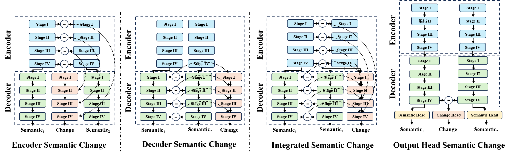

# 3DSCD

         

In this method, the principles and mechanisms of the 3D semantic change detection methods are analyzed in detail to verify that there is a mutually beneficial deep-coupling relationship between semantics and change, and a deep learning based urban 3D Semantic Change Detection method, 3DSCD, is proposed, which segments semantic categories while detecting changes and deeply couples the semantic and change in the model structure to mutually promote and reinforce each other, achieving the superior comprehensive performance of 3D from-to semantic change detection. The efficiency of 3DSCD on urban 3D semantic change detection has been demonstrated by multiple experiments. The method is in submission and the code will be coming soon.
